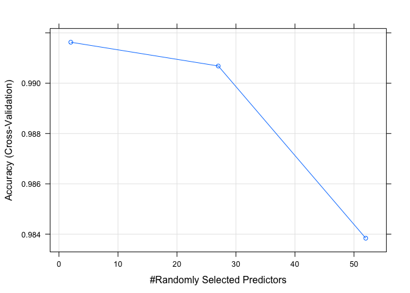
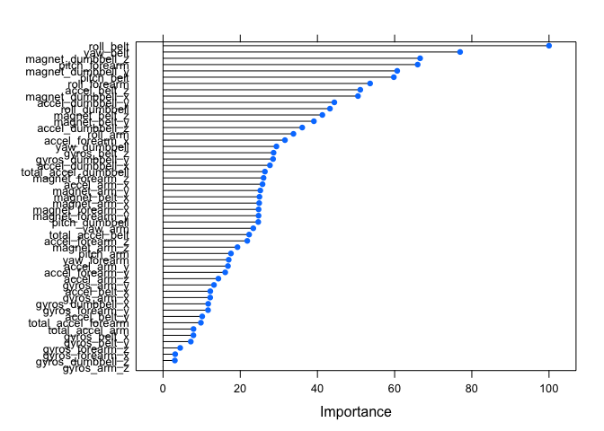

# Practical Machine Learning Course Project
Yisong Tao  
August 23, 2015  

##Background

Using devices such as Jawbone Up, Nike FuelBand, and Fitbit it is now possible to collect a large amount of data about personal activity relatively inexpensively. These type of devices are part of the quantified self movement – a group of enthusiasts who take measurements about themselves regularly to improve their health, to find patterns in their behavior, or because they are tech geeks. One thing that people regularly do is quantify how much of a particular activity they do, but they rarely quantify how well they do it. In this project, your goal will be to use data from accelerometers on the belt, forearm, arm, and dumbell of 6 participants. They were asked to perform barbell lifts correctly and incorrectly in 5 different ways. 

##Goal
The goal of your project is to predict the manner in which they did the exercise. This is the "classe" variable in the training set. You may use any of the other variables to predict with. You should create a report describing how you built your model, how you used cross validation, what you think the expected out of sample error is, and why you made the choices you did. You will also use your prediction model to predict 20 different test cases. 

##Load libraries, set seed for random number generator

```r
library(abind)
library(arm)
library(caret)
library(kernlab)
library(klaR)
library(rattle)
library(randomForest)
library(rpart)
set.seed(1111)
```

##Load datasets, remove variables with > 50% missing values and variables unrelated to our prediction
The training data for this project are available here: 
*https://d396qusza40orc.cloudfront.net/predmachlearn/pml-training.csv*

The test data are available here: 
*https://d396qusza40orc.cloudfront.net/predmachlearn/pml-testing.csv*

The data for this project come from this source: *http://groupware.les.inf.puc-rio.br/har*. 


```r
train <- read.csv("./pml-training.csv", header = TRUE, na.strings = c("NA","#DIV/0!", ""))
test <- read.csv("./pml-testing.csv", header = TRUE, na.strings = c("NA", ""))
#summary(train)
#summary(test)
na_flag <- sapply(colnames(train), function(x) if(sum(is.na(train[, x])) > 0.50*nrow(train))    {return(TRUE)
}else{
return(FALSE)
}
) #remove the variable with >50% missing values 
train <- train[, !na_flag]
train <- train[, -(1:7)] #remove unrelated variable
names(train)
```

```
##  [1] "roll_belt"            "pitch_belt"           "yaw_belt"            
##  [4] "total_accel_belt"     "gyros_belt_x"         "gyros_belt_y"        
##  [7] "gyros_belt_z"         "accel_belt_x"         "accel_belt_y"        
## [10] "accel_belt_z"         "magnet_belt_x"        "magnet_belt_y"       
## [13] "magnet_belt_z"        "roll_arm"             "pitch_arm"           
## [16] "yaw_arm"              "total_accel_arm"      "gyros_arm_x"         
## [19] "gyros_arm_y"          "gyros_arm_z"          "accel_arm_x"         
## [22] "accel_arm_y"          "accel_arm_z"          "magnet_arm_x"        
## [25] "magnet_arm_y"         "magnet_arm_z"         "roll_dumbbell"       
## [28] "pitch_dumbbell"       "yaw_dumbbell"         "total_accel_dumbbell"
## [31] "gyros_dumbbell_x"     "gyros_dumbbell_y"     "gyros_dumbbell_z"    
## [34] "accel_dumbbell_x"     "accel_dumbbell_y"     "accel_dumbbell_z"    
## [37] "magnet_dumbbell_x"    "magnet_dumbbell_y"    "magnet_dumbbell_z"   
## [40] "roll_forearm"         "pitch_forearm"        "yaw_forearm"         
## [43] "total_accel_forearm"  "gyros_forearm_x"      "gyros_forearm_y"     
## [46] "gyros_forearm_z"      "accel_forearm_x"      "accel_forearm_y"     
## [49] "accel_forearm_z"      "magnet_forearm_x"     "magnet_forearm_y"    
## [52] "magnet_forearm_z"     "classe"
```

##Partition train dataset to get new train and test datasets

```r
inTrain = createDataPartition(y=train$classe, p=0.7, list=FALSE)
new_train = train[inTrain,]
new_test = train[-inTrain,]
```
Our `new_train` dataset has 13737 observations and `new_test` dataset has 5885 observations.

##Random Forest modelling 

We then use Random Forest method to develop a predictive model on our `new_train` dataset. We are going to use 5-fold cross validation in our predictive method. 

```r
#RFcontrol <- trainControl(method="cv", 5)
#RFmodel = train(classe ~ ., method="rf", data=new_train, trControl=RFcontrol, ntree = 250)
#saveRDS(RFmodel, "rfmodel.RDS")
#The above lines were commented out to save time on editing. The RF model process was done for the first time and the resulting model was saved to file "rfmodel.RDS". 
RFmodel = readRDS("rfmodel.RDS")
RFmodel
```

```
## Random Forest 
## 
## 13737 samples
##    52 predictor
##     5 classes: 'A', 'B', 'C', 'D', 'E' 
## 
## No pre-processing
## Resampling: Cross-Validated (5 fold) 
## Summary of sample sizes: 10990, 10990, 10989, 10990, 10989 
## Resampling results across tuning parameters:
## 
##   mtry  Accuracy   Kappa      Accuracy SD  Kappa SD   
##    2    0.9916282  0.9894091  0.001765934  0.002234914
##   27    0.9906819  0.9882124  0.001579484  0.001998877
##   52    0.9838387  0.9795544  0.004667691  0.005905892
## 
## Accuracy was used to select the optimal model using  the largest value.
## The final value used for the model was mtry = 2.
```
Maximum accuracy is 98.94% at mtry = 2 and is with out of sample error of 1.06%.


```r
plot(RFmodel)
```

 
##Validate model against `new_test` dataset

```r
confusionMatrix(new_test$classe, predict(RFmodel, new_test))
```

```
## Confusion Matrix and Statistics
## 
##           Reference
## Prediction    A    B    C    D    E
##          A 1672    2    0    0    0
##          B    3 1132    4    0    0
##          C    0   10 1014    2    0
##          D    0    0   19  945    0
##          E    0    0    1    2 1079
## 
## Overall Statistics
##                                           
##                Accuracy : 0.9927          
##                  95% CI : (0.9902, 0.9947)
##     No Information Rate : 0.2846          
##     P-Value [Acc > NIR] : < 2.2e-16       
##                                           
##                   Kappa : 0.9908          
##  Mcnemar's Test P-Value : NA              
## 
## Statistics by Class:
## 
##                      Class: A Class: B Class: C Class: D Class: E
## Sensitivity            0.9982   0.9895   0.9769   0.9958   1.0000
## Specificity            0.9995   0.9985   0.9975   0.9962   0.9994
## Pos Pred Value         0.9988   0.9939   0.9883   0.9803   0.9972
## Neg Pred Value         0.9993   0.9975   0.9951   0.9992   1.0000
## Prevalence             0.2846   0.1944   0.1764   0.1613   0.1833
## Detection Rate         0.2841   0.1924   0.1723   0.1606   0.1833
## Detection Prevalence   0.2845   0.1935   0.1743   0.1638   0.1839
## Balanced Accuracy      0.9989   0.9940   0.9872   0.9960   0.9997
```

```r
RFModelAccuracy <- mean(predict(RFmodel, new_test) == new_test$classe) * 100
```
The accuracy of our model is 99.2693288% when applying to test dataset.

```r
plot(varImp(RFmodel))
```

 
Above is a plot of all the every variable in the `new_test` dataset.

##Conclusion
We've found a model with Random Forest method. When we cross validate the model against our `new_test` dataset we get a high accuracy of 99.2693288%.

